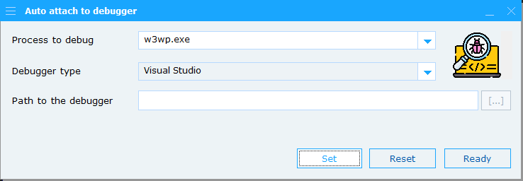

AutoAttach to Debugger
======================

Some programs or DLL's cannot be debugged by simply starting the program from within Visual Studio.
One of the better examples is when we try to debug a Windows service or an IIS module or attachment.
In such cases, we can use the AutoAttachDebugger utility to automatically attach the Visual Studio debugger to a process when it starts.

How it works
------------

After starting tthe "AutoAttachDebugger.exe" utility, add the name of the program (e.g. "w3wp.exe")
and press the "Set" button. By default it will use the Visual Studio debugger. If setting the debugger worked, the 
icon to the right of the screen will change from the normal state (green) to the debugger icon.

Just start the program you want to debug (e.g. start the IIS service or Windows service) and the Visual Studio debugger
will come up with an attachment dialog to choose the version of Visual Studio you want to use.
Debugging then commences at the first entry of the program on.

Resetting the normal mode
-------------------------

After debugging and detaching your debugger, you can reset the state by using the "Reset" button of the utility.

Customizing your debugger
-------------------------
Instead of the default Visual Studio debugger, you can use any other debugger you like, like e.g. "WinDbg".
To do so, change the combo box from "Visual Studio" to "Windows debugger" and enter the full path of the debugger.
You can also use the button to the right of the debugger path to browse to the debugger executable.